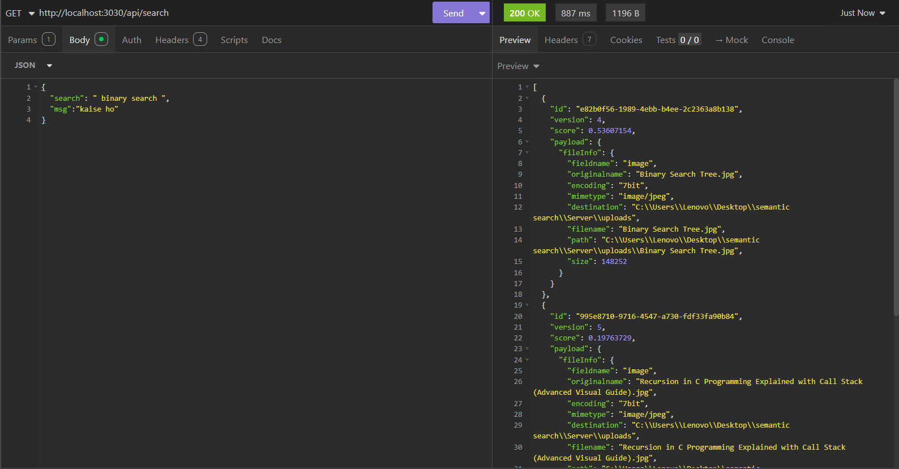
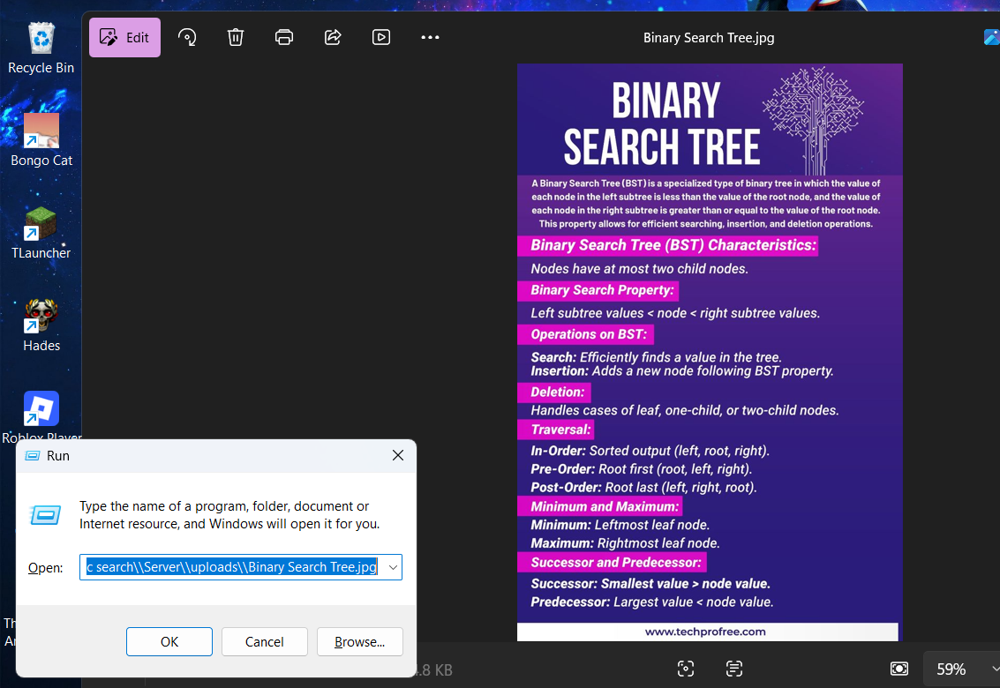
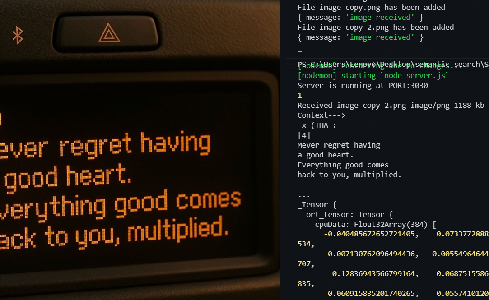

# Semantic File Search

A local semantic search system that allows users to search images using natural language(nlp) queries instead of exact filenames, enabling searchig via context over filenames

## Architecture

User Query --> Embedding Model --> Qdrant Vector Search --> Matching Files

## Search Example

  

## Retrieved Result

  

## OCR Extraction

  

## Features

- Upload images
- Extract text using OCR
- Generate embeddings from extracted text via Local Ai model
- Store embeddings in Qdrant Vector Database
- Perform semantic similarity search
- Retrieve relevant images using natural language queries
- Open matched files locally

## Tech Stack

- Node.js
- Express.js
- Qdrant - vector db
- Docker - runs the qdrant image locally
- OCR (Text Extraction) - Tesseract.js
- Embedding Model (all-MiniLM-L6-v2) - Transformer.js
- Multer - for handling files/uploads

## How It Works

### Image Upload

1. User uploads an image.
2. OCR extracts text from the image.
3. Extracted text is converted into embeddings.
4. Embeddings and file metadata are stored in Qdrant.

### Search

1. User enters a natural language query.
2. Query is converted into an embedding.
3. Qdrant performs vector similarity search.
4. Relevant file's address/file are returned based on semantic similarity.

## Example Queries

- binary search tree
- recursion explained
- graph traversal notes
- jwt authentication

The search does not rely on filenames and instead retrieves results based on semantic meaning.

## Current Limitations

- Primarily optimized for text-rich images.
- Performance depends on OCR quality.
- Non-textual images are not handled well yet.
- Currently supports image files only.

## Future Improvements

- Support for PDFs
- Support for PowerPoint files
- Multimodal retrieval using image embeddings
- Improved ranking and relevance scoring
- Metadata and recency-based ranking

## Project Goal

The objective is to build a local knowledge retrieval system to help the user manage and find his pdfs,screenshots, txt files and other documents

# --------------------------------------------------------------------

# Sources-->

- embedder: https://huggingface.co/Xenova/clip-vit-base-patch32
- ocr: https://github.com/naptha/tesseract.js/blob/master/docs/examples.md
- vector db: https://qdrant.tech/documentation/quickstart/

docker run -d --name myQdrantDB -p 6333:6333 qdrant/qdrant
docker start myQdrantDB
docker stop myQdrantDB
